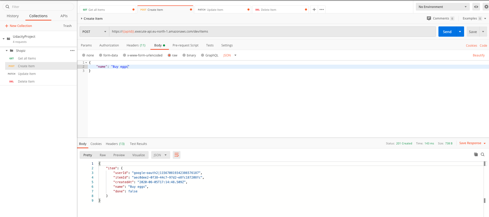
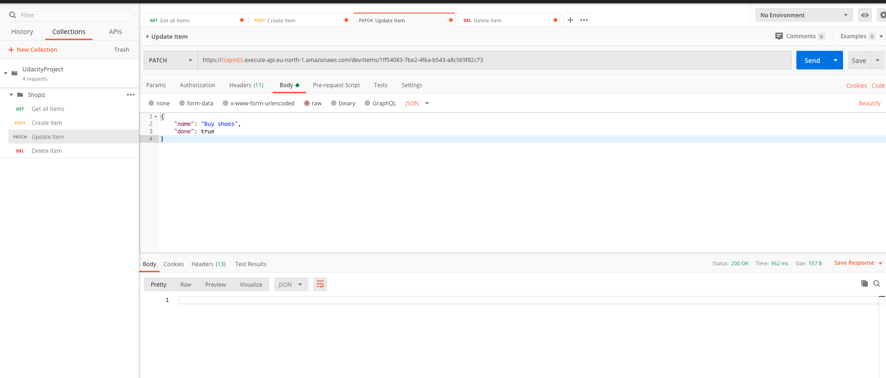
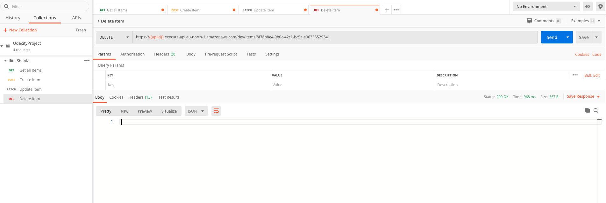

# SHOPIZ - Serverless application to make shopping more fun!

## Tools
For this application I have used following tools:
1. Serverless application framework
2. AWS DynamoDB
3. APIGateWay
4. AWS Lamda functions
5. Auth0 (Authentication)
6. Postman

## Operations
You can perform Add, edit, get and remove operations on the application. The main focus here was on serverless backend application develpement therefore client application has limited funcitonality such as Login/Logout and get shopping list. The application only shows shopping list of logged in user, meaning that if you as user login it will show shopping list which you have created. Once you log out and log in through different credentials it will show shopping list of that user. I have not used S3 bucket for images like Todo list since it was not requirement of the application. 

### Add Item 
It is possible to add a shopping item with partion key and sort key as User and Item. This way it should be possible to access items only for a specific (logged in) user. 

### Get Items
Since we added items for each user it is possible to get images only for specific user. For postman you can use the TokenId. For client this token is accessed through a call back from Auth0 application.   

### Update Items
It is possible to update attributes of an item. We can change the name and done (status) through DynamoDB updateItem function.    

### Delete Items
It shall be possible to delete item by providing the itemId together with UserId, which is already coming through TokenId.     

## How to run the application

### Install following utilities:
- npm 
- serverless framework
- aws cli

### Steps
- create a aws user with full admin rights ( you need them initially while create cloud formation stack)
- configure aws user on local system (access key, secret key)
- git clone the applcation to your local directory. 
- cd to backend
- run npm install 
- run sls deploy -v
- add api endpoint in config.ts in "client" application.  
- create auth0 application and add domain and clientId in config.ts in "client" application. 
- cd to client and run "npm start"
- http://localhost:3000 login to frontend and in inspect under "console" section get TokenId
- one can use this tokenId in postman to perform all operations in postman.  

